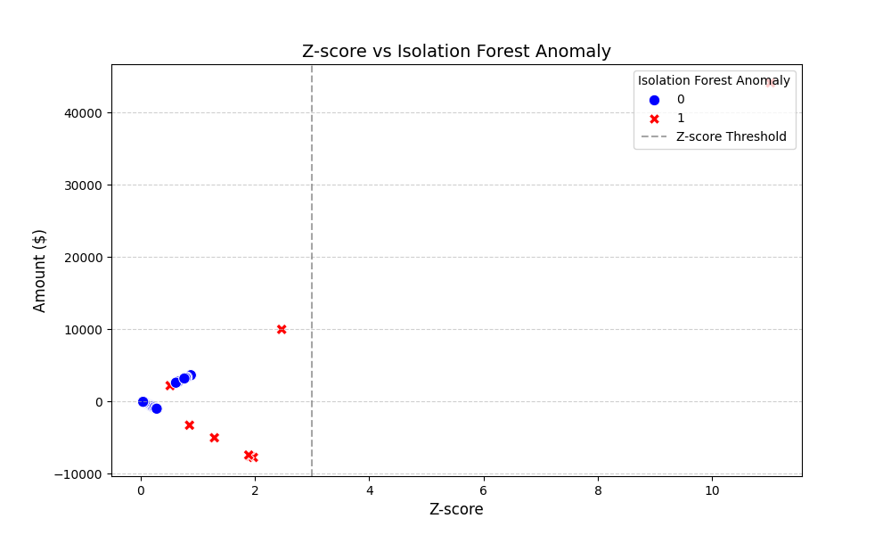

# 💰 Personal-Finance-Tracker-with-Anomaly-Detection
A Python-based finance tracker using Pandas and anomaly detection techniques to identify irregular expenses and improve financial planning.

**Live Demo:** [Click here to try the app](https://personal-finance-tracker-with-anomaly-detection.streamlit.app/)

## Overview
The **Personal Finance Tracker with Anomaly Detection** is a Python-based application designed to help users take control of their personal finances.  
It allows users to monitor their income, expenses, and savings while providing actionable insights through interactive visualizations.  

The project goes beyond basic finance tracking by implementing **anomaly detection** techniques, including statistical methods like **Z-score** and machine learning methods like **Isolation Forest**, to identify unusual transactions or spending patterns.  

The app uses a **synthetic dataset** generated with Python's Faker library to simulate realistic financial transactions, ensuring that users can explore the tool even without real data. Visualizations are built using **Plotly** and **Seaborn**, providing intuitive charts for monthly trends, expense breakdowns by category, and highlighting potential anomalies.  

This project is ideal for anyone interested in personal finance management, data analysis, or learning how statistical and machine learning methods can be applied to real-world problems.

## Features
- Income and expense tracking  
- Interactive visualizations using Plotly and Seaborn  
- Anomaly detection to flag unusual transactions  
- Synthetic dataset generation for testing

## Tech Stack
- Python
- Pandas, NumPy
- Scikit-learn
- Matplotlib, Seaborn, Plotly
- Streamlit

## Project Workflow 

This project was developed in multiple stages, reflecting a complete end-to-end data analysis and deployment pipeline:

1. **Data Generation:**  
   Using Python's **Faker** library, a synthetic dataset of financial transactions was generated. The dataset includes multiple categories such as food, rent, travel, shopping, and utilities, simulating realistic income and expense patterns.

2. **Data Cleaning and Preparation:**  
   The raw synthetic data was cleaned and preprocessed to handle missing values, ensure consistent formatting, and prepare it for analysis. The cleaned dataset [personal_finance_clean.csv] serves as the foundation for all visualizations and anomaly detection.

3. **Anomaly Detection Implementation:**  
   Two methods were implemented to detect unusual transactions:  
   - **Z-score:** A statistical method to identify outliers based on deviation from the mean.  
   - **Isolation Forest:** A machine learning algorithm capable of detecting anomalous patterns in multi-dimensional transaction data.  

4. **Visualization and Insights:**  
   Interactive and static charts were created using **Plotly** and **Seaborn**. These visualizations provide monthly trends, category-wise spending breakdowns, and highlight anomalies. Each chart is accompanied by insights to help understand the financial patterns and unusual transactions.

5. **Deployment:**  
   Finally, the project was deployed as a **Streamlit app** on the **Streamlit Community Cloud**, allowing users to interact with the tracker, explore visualizations, and see anomalies in real time.

## Notebooks
You can explore the detailed analysis and experimentation in the following notebook:  

- [Data Generation & Cleaning](notebooks/personal_finance_tracker_with_anomaly_detection.py)  

## **Visualization** 
## 📊 Visualizations

### 1. Amount vs Date (Anomalies highlighted)
  
**Insight:** 
1. Red dots show anomalies detected by Isolation Forest.
2. These unusual transactions are scattered across time, showing no specific monthly pattern.
3. The Isolation Forest algorithm effectively flags outliers across the full range of dates, not just clusters.

---

### 2. Amount_Zscore vs Anomaly_ISO
  
**Insight:**
1. Most transactions cluster around the z-score between 0 and 1.
2. Some Z-score points are flagged as anomalies (Tiny charges).
3. High Z-scores often correspond to anomalies, but not always.
4. The two methods partially overlap in anomaly detection.
5. Points beyond z=3 are extreme but may not always match ISO anomalies.

   

